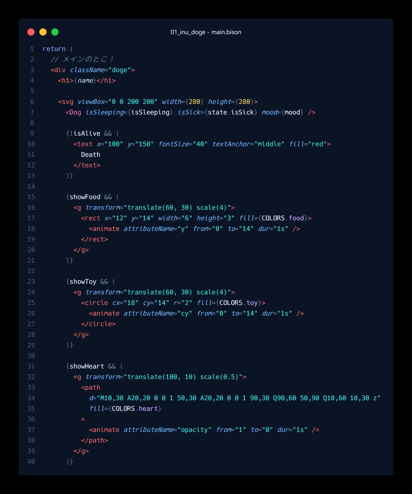
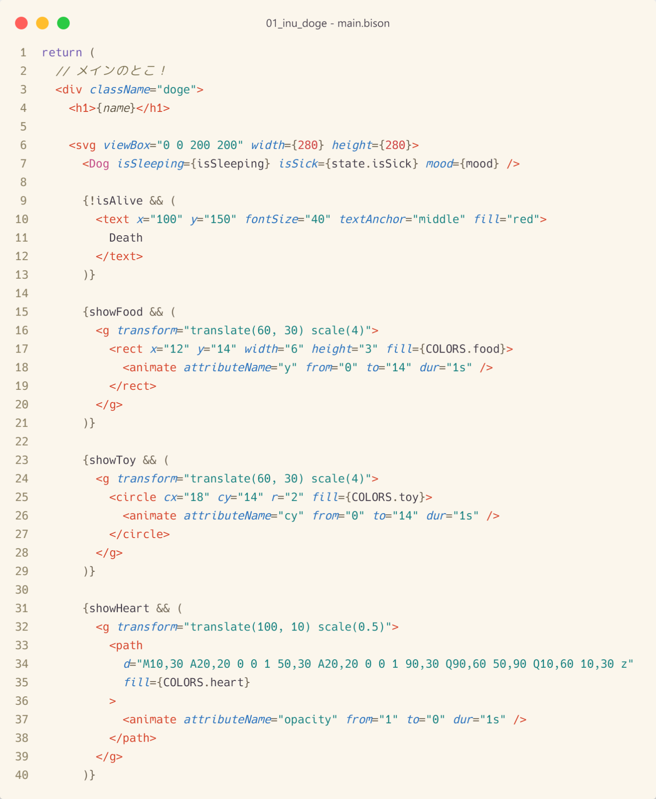

# Tsukuyomi & Reply

Two VS Code color themes inspired by the Netflix film **超かぐや姫!** (*COSMIC PRINCESS KAGUYA!*, **"CPK!"**).

- **Tsukuyomi** — dark
- **Reply** — light

> These themes are one fan's reading of the film's visual language. If a color choice doesn't match how you experience the work, please fork and adjust any value to taste.

## Preview





## Install

Open the Extensions view in VS Code, search for `Tsukuyomi Reply` (or `CPK`), and click **Install**. From the command palette: `ext install warudakumi.tsukuyomi-reply`.

Then press `Ctrl`/`Cmd` + `K`, `Ctrl`/`Cmd` + `T` and pick **Tsukuyomi** or **Reply**.

Optional, for richer coloring:

```jsonc
// settings.json
"editor.semanticHighlighting.enabled": true
```

## Palette

For anyone who just wants the color codes.

### Tsukuyomi (dark)

| Role | Hex |
| --- | --- |
| Background (editor) | `#0B1424` |
| Background (UI) | `#081020` |
| Foreground | `#DCE6F2` |
| Comment | `#6E85A2` |
| Keyword | `#8FA6FF` |
| Function | `#FFA24C` |
| String | `#36E0D8` |
| Number | `#F4CF6A` |
| Constant | `#F4CF6A` |
| Type / Class | `#FF6FC2` |
| Property | `#C9A6FF` |
| Variable | `#DCE6F2` |
| Parameter | `#BFD0EC` |
| Regex / Escape | `#79E6B0` |
| Tag | `#FF6D6D` |
| Attribute | `#6FB4FF` |
| Operator | `#7488A4` |
| Punctuation | `#627490` |
| Cursor | `#FFA24C` |
| Selection | `#234567` |
| Find / highlight | `#F4CF6A` |
| Accent (UI) | `#FFA24C` |
| Link / focus | `#36E0D8` |
| Error | `#FF6D6D` |
| Warning | `#F4CF6A` |
| Info | `#6FB4FF` |

### Reply (light)

| Role | Hex |
| --- | --- |
| Background (editor) | `#FBF6EC` |
| Background (UI) | `#F1E8D6` |
| Foreground | `#3A3340` |
| Comment | `#7A7050` |
| Keyword | `#6B53AE` |
| Function | `#C9531C` |
| String | `#137F7E` |
| Number | `#CE4242` |
| Constant | `#8F680C` |
| Type / Class | `#C24A86` |
| Property | `#3A3340` |
| Variable | `#3A3340` |
| Parameter | `#5E5544` |
| Regex / Escape | `#4F8A2F` |
| Tag | `#D6452C` |
| Attribute | `#2A72BE` |
| Operator | `#6A5F4E` |
| Punctuation | `#6A5F4E` |
| Cursor | `#C9531C` |
| Selection | `#F6E2A0` |
| Find / highlight | `#F4C84A` |
| Accent (UI) | `#D6452C` |
| Link / focus | `#2A72BE` |
| Error | `#C53A28` |
| Warning | `#9A720F` |
| Info | `#2A72BE` |

## License

Theme files are released under the MIT License.

## Disclaimer

This is an unofficial, fan-made project. It is not affiliated with, endorsed by, or sponsored by Netflix, Studio Colorido, Studio Chromato, or コロリド・ツインエンジンパートナーズ. It contains no official artwork, footage, screenshots, or logos — only original color values and code created for this project. Free and non-commercial.

*超かぐや姫!* (*COSMIC PRINCESS KAGUYA!*) and all related names are trademarks of their respective owners.
© コロリド・ツインエンジンパートナーズ
